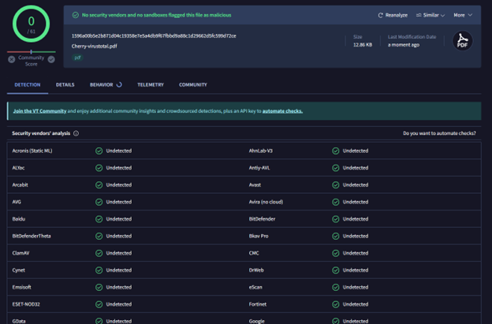
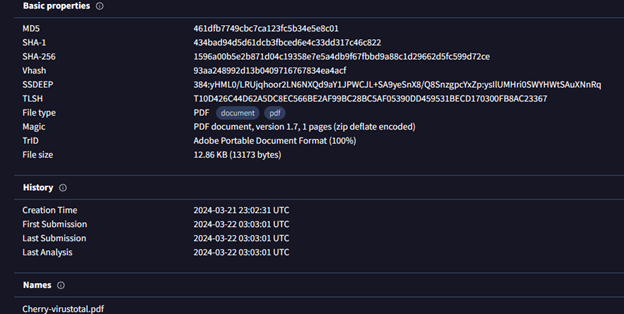
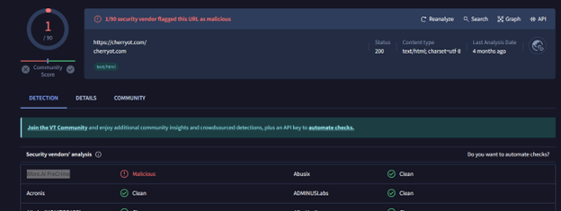

# Task 2: Checking files or links for problems #

1.	Create a word file called VirusTotal.docx or VirusTotal.doc, then convert the file to a "Yourname-virustotal.pdf" file. You could also include the eicar files.
2.	Open the site  VirustotalLinks to an external site. and scan the pdf file you created. Look at the detail tab and read the analysis.
3.	At this site you can also a URL and scan that too, check out details. Try Brccpcfix and other small sites you know of. 

## What i did ##

1-2. Mine resulted in undetected. Green colors. This is very cool and useful. I did not know there’s site for this and security vendors provide their found milieus website database to detect similar malicious files. I could use this to test my parent’s PC.

 

It does show crypted hashes and other file information.

3. Resulted clean in various vendors but further down it is unrated.

Details showed a bunch of other data, Ip address, status code, body length.
And there was a hash so I tried using the analyse and it was also green… It also showed they are using AWS cloud, Amazon S3…

I also tried my site that I no longer use the domain now and just waiting for it to expire: http s: //cherryot. com/ \
But it was flagged malicious by Bfore.Ai PreCrime……upon research this company uses predictive AI to predict whether something is unsafe or not. \
But others say it can be false positive too. \

Although, when I tried www .cherryot. com, a new ribbon tab is popped called relations and it showed a bit of its history. \
I purchased this domain only last year but it was being used in prior years. And more flags from 2020. \
The site I have on that domain is not up right now, but I am reconsidering for a better domain name because of this.

